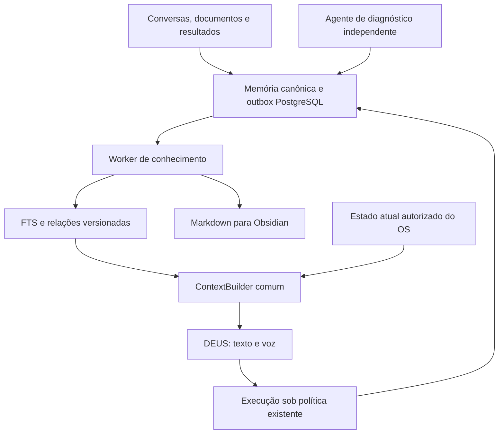

# Arquitetura integrada proposta

## Escopo e sucesso

Entregar memória persistente com proveniência, recuperação entre conversas e paridade texto/voz. Agentes publicam diretamente por contratos e eventos, sem cadeia de Universos. DEUS coordena e responde; ferramentas executam com política de domínio. Não colocar todos os fatos dentro do prompt nem tornar o LLM a única base de dados.

## Componentes e responsabilidades

KnowledgeService grava fontes/revisões/outbox numa transação, verifica proveniência, proprietário e idempotência. KnowledgeIndexer consome com checkpoint e deriva chunks/links sem LLM síncrono. KnowledgeRetriever filtra acesso antes de ranking e consulta apenas revisões vigentes e fontes acessíveis. DeusContextBuilder compõe foco/histórico/evidências/estado atual com prazo. DiagnosticsService coleta observações e incidentes em processo próprio. ObsidianExporter deriva arquivos a partir de revisões exportáveis.

Comunicação entre componentes por contratos internos; API authenticated fornece acesso ao usuário. Não adicionar outra malha de agentes ou broker obrigatório. Worker de indexação é independente de LLM_PROVIDER e tem restart/backoff; não reutilizar o worker de missões como único loop.

## Base existente a preservar

Memórias de conversa/missão/Universo, Chronicle, política de proveniência, auth soberana, auditoria/cache e protocolos locais de voz. Não remover/renomear Universos; relações transversais eliminam a dependência de divisões para recuperar informação. Não alterar modelo Kokoro, wake word ou STT neste projeto.

## Regras globais — valores propostos

G01: Python3.12+, FastAPI, SQLAlchemy2, Alembic, PostgreSQL existente; nenhum serviço pago novo obrigatório.
G02: recuperação em português com nomes/códigos técnicos literais; UTF-8.
G03: máximo6 trechos, expansão relacional máxima1 salto, evidências até2000 tokens estimados; máximo8000 caracteres por chunk e1500 caracteres por trecho entregue. Usar estimativa ceil(UTF-8 bytes/3), conservadora mas sem garantia de tokenização do fornecedor; limite global16KiB para envelope de evidências.
G04: deadline de contexto300ms inicialmente; query retrieval statement_timeout200ms. São defaults experimentais, não resultados medidos. Configuração validada:25–1000ms; deadline query menor que deadline contexto.
G05: normal dialogue não chama LLM extra para retrieval/classificação/resumo. Não prometer redução do tempo do fornecedor FreeLLM.
G06: a origem é revalidada na busca; fonte revogada/excluída não é recuperada mesmo se indexador estiver atrasado.
G07: fontes externas são conteúdo não confiável, nunca role system nem autorização. Regras de ferramentas independem da obediência do modelo.
G08: flags DEUS_KNOWLEDGE_INGESTION_ENABLED, DEUS_CONTEXT_RETRIEVAL_ENABLED, DEUS_DIAGNOSTICS_ENABLED, DEUS_OBSIDIAN_EXPORT_ENABLED começam false. Desativar retrieval mantém história/snapshot atual.
G09: sem instalação/ativação automática de MCPs, monitor externo, correção de serviço, embedding local ou importação bidirecional no MVP.
G10: incidentes e conhecimento possuem proprietário; health interno do host só é exportado para Creator soberano autorizado. Universo não é fronteira de autorização.

## Entregas por subsistema

S1 memória: registros/revisões, ingestão/backfill e busca textual, utilizável por API.
S2 contexto: comportamento central entregue no texto/voz e rastreabilidade de fontes.
S3 diagnóstico: sondagens/incident journal e integração ao conhecimento.
S4 Obsidian: exportação reproduzível e navegável.

S2 depende deS1. S3 eS4 dependem deS1; ambos são opcionais para lançarS2. Embeddings são decisão posterior, não dependência de nenhum plano.

## Observabilidade

Context trace registra status de recuperação, duração, fontes/revisões, tamanho do envelope, índices/epoch, snapshot observado e motivo de degradação. Não copiar conteúdo integral, tokens, senhas ou credenciais para logs. Métricas agregadas de latência/retrieval/index lag/queue backlog. Logs de áudio por frame nunca entram em Chronicle: registrar mudanças de estado e agregações.

## Compatibilidade e rollout

Migrações aditivas; não inventar próximo número Alembic antes de conferir heads no branch de execução. Flags por subsistema e acesso interno somente. Rollback desliga funcionalidades e mantém registros; downgrade destrutivo não é rollback de produção. API atual mantém forma; campos de fontes são aditivos/opcionais. Primeiro lançar em projeto piloto com baseline medido.
